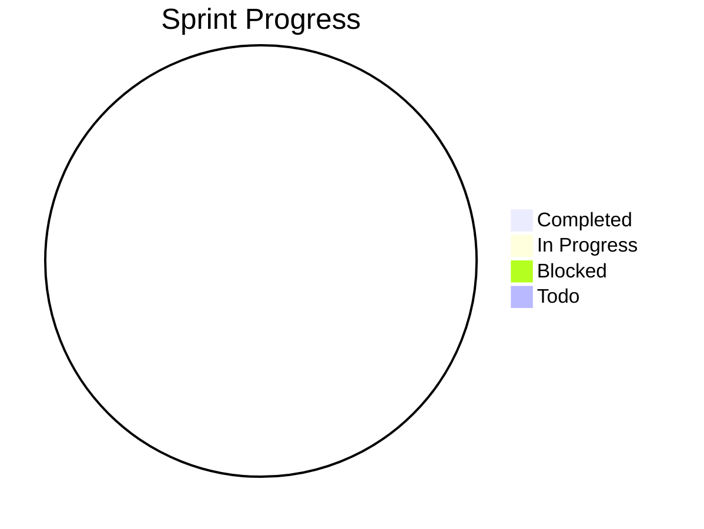

---
# Project Metadata - Parsed by JellyLaunch for status display
project: "Project Name"
version: "1.0.0"
status: active           # active | on-hold | completed | blocked
priority: medium         # critical | high | medium | low
health: 100              # 0-100 overall project health
last_updated: ""
agent_session: null      # Current AI agent session ID
---

# Project Name - Development Tracker

> **Quick Stats**: 0 tasks total • 0 completed • 0 in progress • 0 blocked

---

## 🎯 Current Sprint

### In Progress
<!-- Format: - [/] #ID Task description `@agent|@human` `~Xh` `tag` -->

### Blocked
<!-- Format: - [!] #ID Task description `@agent|@human` `~Xh` `tag` -->
<!--         > Reason for block -->

### Todo
<!-- Format: - [ ] #ID Task description `@agent|@human` `~Xh` `tag` -->

---

## ✅ Completed This Sprint
<!-- Format: - [x] #ID Task description `@agent|@human` `~Xh` ✓YYYY-MM-DD -->

---

## 📋 Backlog

### High Priority

### Medium Priority

### Low Priority

---

## 📊 Progress Visualization

---

## 📝 Session Notes

### YYYY-MM-DD - Session Type
> Notes about the session...

---

## 🔧 Technical Debt

---

## 🐛 Known Issues

---

<!-- 
AGENT INSTRUCTIONS:
When updating this file, please:
1. Update the `last_updated` field in frontmatter to current ISO timestamp
2. Set `agent_session` to your session ID
3. Move completed tasks to the Completed section with ✓ and date
4. Add session notes explaining what was done
5. Update the `health` percentage based on:
   - Blocked tasks reduce health (-10 each)
   - Stale tasks (no update in 3+ days) reduce health
   - Completed tasks in current sprint increase health
6. Update the Quick Stats comment at the top
7. Update the mermaid pie chart numbers

TASK STATUS NOTATION:
- [ ] = Not started (todo)
- [/] = In progress
- [x] = Completed
- [!] = Blocked
-->
